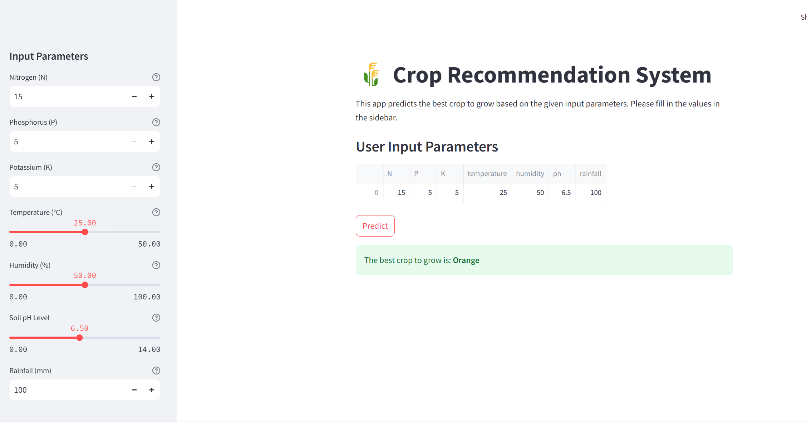

# 🌾 Crop Recommendation System

## About The Project

Agriculture plays a vital role in the economy, and selecting the right crop to cultivate is crucial for maximizing yield and ensuring sustainability. The **Crop Recommendation System** is a machine learning-based web application designed to assist farmers in choosing the most suitable crop based on soil properties and environmental factors.

## Features

- **Interactive Web Interface:** Built using Streamlit for an intuitive user experience.
- **Machine Learning Model:** Utilizes a Random Forest Classifier to predict the best crop.
- **Data Visualization:** Provides insights into crop distribution and feature correlations.
- **Model Training & Evaluation:** Includes scripts for training, hyperparameter tuning, and evaluating the model.
- **Easy Deployment:** Hosted on Streamlit Cloud for accessibility from anywhere.

## Demo

Access the live application [**here**](https://croprecommendationappgit-3mimxcnmiukx7tzk6bcejf.streamlit.app/).



## Getting Started

Follow these instructions to set up and run the project on your local machine.

### Prerequisites

- **Python 3.7+**: Ensure you have Python installed. You can download it [here](https://www.python.org/downloads/).
- **Git:** To clone the repository. Get it [here](https://git-scm.com/downloads).

### Installation

It's recommended to use a virtual environment to manage dependencies.

#### Create a Virtual Environment

Execute the following commands based on your operating system to create and activate a virtual environment.


```bash
# On Windows
python -m venv venv
venv\Scripts\activate

# On macOS/Linux
python3 -m venv venv
source venv/bin/activate
```

## Install Dependencies
Upgrade pip and install the required Python packages listed in `requirements.txt`.


```bash
pip install --upgrade pip
pip install -r requirements.txt
```

## Train the Machine Learning Model
Execute the `train.py` script to train the model and save necessary artifacts.

```bash
python train.py
```

This will create a `models/` directory containing:

- `best_rfc.pkl`: Trained Random Forest model.
- `scaler.pkl`: Scaler for feature scaling.
- `label_encoder.pkl`: Encoder for target labels.

## Usage
Run the Streamlit application locally to interact with the Crop Recommendation System.

```bash
streamlit run app.py
```

### Application Features:
- **Input Parameters**: Use the sidebar to input soil and environmental parameters such as Nitrogen (N), Phosphorus (P), Potassium (K), Temperature, Humidity, pH, and Rainfall.
- **Predict**: Click the "Predict" button to receive a crop recommendation based on the input parameters.
- **Visualizations**: Explore data distributions and model insights through various visualizations provided within the app.
